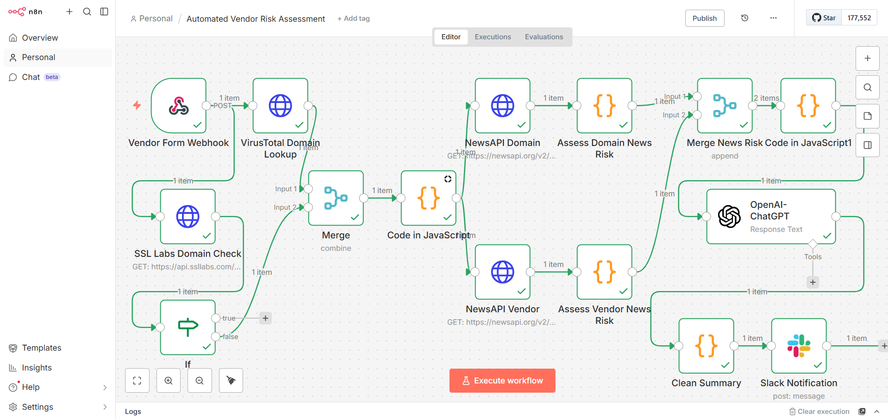
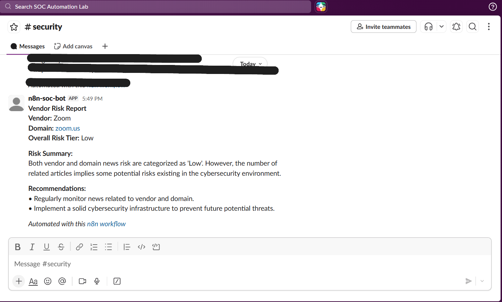

# Automated-Third-Party-Vendor-Risk-Assessment-VRA-using-AI-and-n8n-Workflow-Automation
An **End-to-End Solution for Third-Party Vendor Risk Assessment (VRA)** that Drastically Reduces Vetting Time to Minutes by Automating Domain Reputation Checks, Real-Time Security Incident Monitoring, and Deep Risk Synthesis using Generative AI (ChatGPT) and the n8n Workflow Platform.

---

**The system automates:**

- Domain reputation checks

- SSL/TLS security validation

- Real-time security incident monitoring

- AI-generated risk summaries and recommendations

The workflow is orchestrated using **n8n**, integrating multiple cybersecurity intelligence sources and AI to produce a **structured risk report and Slack alert** for security teams.

## Lab Setup and Requirements
**1. n8n Instance**

A running instance of n8n.

Example deployment used in this project:
```
n8n running in Docker container
Host machine: Windows
```

**2. API Keys**

Valid API keys are required for the following services:

**Domain Reputation & Threat Intelligence**

- VirusTotal

**SSL Certificate Security Validation**

- Qualys SSL Labs

**Real-Time News Monitoring**

- NewsAPI

**AI Risk Analysis**

- OpenAI

**Alerting & Notification**

-  Slack

## Task 1: Data Collection and Initial Security Assessment

This task captures vendor input and performs the primary security checks.

### Node 1: Form Trigger

**Type**
```
n8n-nodes-base.formTrigger
```
**Purpose**

Collect vendor information from internal stakeholders requesting vendor approval.

**Fields Collected**
```
Vendor_Name
main_domain
criticality_tier (High / Medium / Low)
service_provided
```
**Example submission:**
```
Vendor Name: Zoom
Domain: zoom.us
Service: Video Conferencing
Criticality: High
```
This node acts as the **entry point of the workflow.**

### Node 2: Domain Reputation Check (VirusTotal)

**Type**
```
n8n-nodes-base.httpRequest
```
**Purpose**

Check whether the vendor's domain has been flagged for malicious activity.

The system queries threat intelligence sources to detect:

- Malware

- Phishing activity

- Spam

- Blacklist detections

**Example output:**
```
Malicious detections: 0
Reputation score: Safe
```

### Node 3: SSL Labs Certificate / HTTPS Trust

**Type**
```
n8n-nodes-base.httpRequest
```
**API**
```
https://api.ssllabs.com/api/v3/analyze
```
**Purpose**

Analyze the vendor's HTTPS configuration and SSL certificate strength.

SSL Labs evaluates:

- TLS protocol security

- Cipher strength

- Certificate validity

- HTTPS configuration

**Example result:**
```
SSL Grade: A+
```
**Interpretation:**
```
A / A+ → Low Risk
B / C → Medium Risk
D / F → High Risk
```

### Node 4: Status Check (IF Node)

**Type**
```
n8n-nodes-base.if
```
**Purpose**

Check whether the SSL Labs scan has completed.

SSL Labs scans may initially return:
```
IN_PROGRESS
```
If the scan is not ready, the workflow pauses.

### Node 5: Wait Node

**Type**
```
n8n-nodes-base.wait
```
**Purpose**

Pause the workflow for 30 seconds and retry the SSL scan.

This ensures the workflow only continues once the scan status becomes:
```
READY
```

### Node 6: Complete Site Assessment

**Type**
```
n8n-nodes-base.code
```
**Purpose**

Combine results from:

- Domain reputation check

- SSL security analysis

and calculate an overall **technical risk tier.**
```
Risk Logic
High Risk
APIVoid risk_score > 50
OR SSL Grade D/E/F

Medium Risk
APIVoid risk_score > 20
OR SSL Grade B/C

Low Risk
All other cases
```

## Task 2: Real-Time Incident Monitoring

This task scans recent news for vendor-related cybersecurity incidents.

### Node 7 and 8: NewsAPI Search

**Type**
```
n8n-nodes-base.httpRequest
```
Two parallel searches are performed:

**Search by Vendor Name**
```
q={{ $json.vendor }}
```
**Search by Domain Name**
```
q={{ $json.main_domain }}
```
**Both searches include:**
```
from = last 30 days
sortBy = publishedAt
```
**This identifies:**

- Breaches

- Outages

- Vulnerabilities

- Negative press

### Node 9 and 10: Assess News Risk

**Type**
```
n8n-nodes-base.code
```
These nodes analyze article titles and descriptions.

### Keyword Detection

**Critical Keywords**
```
breach
hacked
data leak
ransomware
```
**Warning Keywords**
```
outage
downtime
vulnerability
threat
```
**Risk Scoring**
```
CRITICAL → breach detected
HIGH → warning keywords detected
MEDIUM → large number of articles
LOW → no security issues detected
```

## Task 3: AI-Powered Risk Synthesis

This task merges all results and generates a human-readable risk report.

### Node 11: Merge Node

**Type**
```
n8n-nodes-base.merge
```
**Mode**
```
Append
```
**Purpose**

Combine:

- Vendor news risk

- Domain news risk

into a single payload.

### Node 12: AI Agent (ChatGPT)

**Type**
```
@n8n/n8n-nodes-langchain.agent
```
**Language Model**

ChatGPT

**Purpose**

Analyze all collected data and generate a structured risk report.

Input includes:
```
Technical risk assessment
News risk analysis
Vendor metadata
```

Output JSON format:
```
{
 "overall_risk_tier": "High / Medium / Low",
 "risk_summary": "Detailed explanation of identified risks",
 "recommendations": [
   "Recommendation 1",
   "Recommendation 2"
 ]
}
```

## Final Output

The workflow generates a **structured vendor risk report** and sends it to the security team via Slack.

Example Slack message:
```
Vendor Risk Report

Vendor: Zoom
Domain: zoom.us
Overall Risk Tier: Low

Risk Summary:
No major security threats detected.

Recommendations:
• Continue monitoring vendor security posture
• Review vendor security updates periodically
```

# Conclusion

This project demonstrates how workflow automation and AI can transform the traditional **Vendor Risk Assessment (VRA)** process. Instead of relying on time-consuming manual research, the solution automatically collects vendor information, performs domain reputation checks, analyzes SSL/TLS security posture, monitors recent cybersecurity news, and synthesizes all findings into a structured risk report using AI.

By integrating services such as **VirusTotal, Qualys SSL Labs, NewsAPI,** and AI models from OpenAI within an automated workflow powered by n8n, the system reduces vendor security vetting time from hours or weeks to just a few minutes.

The final output is a clear, structured risk assessment that includes the overall risk tier, a concise risk summary, and actionable recommendations. The report is automatically delivered to security teams via Slack, ensuring that stakeholders receive timely insights for faster and more informed decision-making.

Overall, this project highlights the value of combining cybersecurity intelligence, workflow automation, and generative AI to build scalable and efficient security operations solutions. It provides a practical framework that organizations can extend to enhance third-party risk management, improve visibility into vendor security posture, and strengthen their overall cybersecurity strategy.

# Screenshots



